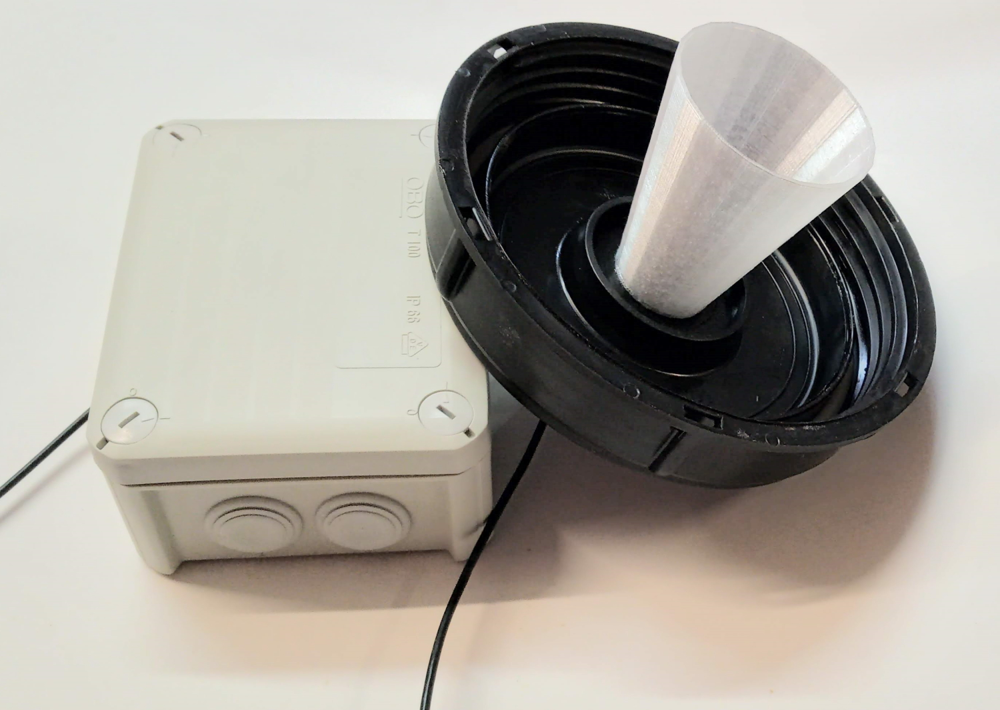

Maker Media GmbH

***

# LoRaWAN-Sensor
## für den Heizöltank

Um den Füllstand eines Behälters zu überwachen, der außerhalb der
Reichweite des eigenen WLANs liegt, habe ich einen LoRa-Sensor
konstruiert. Das Hauptaugenmerk liegt hierbei auf der Minimierung
des Energieverbrauchs, um den Sensor mit Akkus zu betreiben.

Den genauen Aufbau beschreibt der Artikel **[LoRaWAN-Sensor für den Heizöltank](https://www.heise.de/select/make/2020/6/2021114115699440435)** in der Make-Ausgabe 6/20 ab Seite 66. Hier gibt es den Code und die 3D-Datei des Trichters zum Download.
